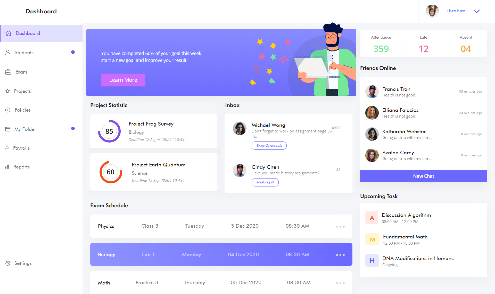

<p align="center">
  

  

  

  

  

</p>


#  Live
  [Check it live](https://student-dashboardd.netlify.app/)

<br>

 ## What's inside?
    ├── frontend
      ├── assets
      ├── bootstrap
      ├── css
      ├── scss
      ├── index.html
      ├── main.scss
    ├── LICENCE
    ├── readme.md

<br>

##  Quick start

1.  **Clone this repository.**

    ```sh
        https://github.com/ferhatkefsiz/student-dashboard.git
    ```

2.  **Running**

    ```sh
        You can simply use a live server extention or your browser.
    ```
3. **Development with Sass**

    If you are using vscode, you can do scss development using [live sass compiler](https://marketplace.visualstudio.com/items?itemName=ritwickdey.live-sass "live sass compiler"). After installing the plugin, please paste the code snippet below into the settings.json file.

    ```json
     "liveSassCompile.settings.formats": [
        {
        "format": "expanded",
        "extensionName": ".css",
        "savePath": "frontend/css"
        },
        {
            "format": "compressed",
            "extensionName": ".min.css",
            "savePath": "frontend/css"
        }
      ],
    ```
<br>

##  Deploy

 [](https://app.netlify.com)
 
<br>
